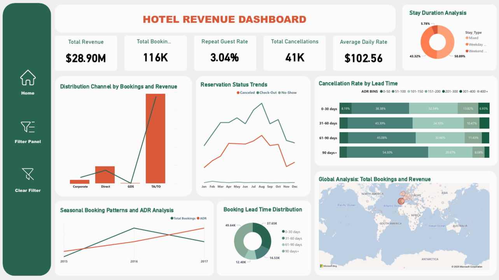

---

# **Hospitality Customer Booking Analysis**  

## **Project Overview**  
This project explores hotel booking data to understand **booking patterns, customer behavior, and factors influencing reservations**. The insights derived will help hotels **optimize operations, improve customer satisfaction, and increase revenue**.  

Using **SQL for data preprocessing, Power BI for visualization, and Python for exploratory data analysis (EDA)**, we uncover key trends in hotel reservations.  

---

## **Dataset & Features**  
The dataset includes information on hotel reservations, such as:  
- Booking status (canceled or confirmed)  
- Customer demographics  
- Reservation dates and lead times  
- Meal preferences  
- Market segment and distribution channels  
- Special requests and stay durations  

---

## **Tools & Technologies Used**  
- **SQL:** Data cleaning and preprocessing  
- **Python (Pandas, Matplotlib, Seaborn):** Exploratory Data Analysis (EDA)  
- **Power BI:** Interactive dashboard for insights visualization  

---

## **Key Insights**  
Some notable findings from the analysis include:  
✅ Trends in reservation cancellations and their impact on revenue  
✅ Peak booking periods and seasonal variations  
✅ Customer preferences for room types and meal plans  
✅ The role of lead time in determining booking confirmation rates  
✅ The influence of market segments and distribution channels on hotel revenue  

---

## **Project Structure**  

```
hotel-customer-booking-analysis/
│-- data/                 # Raw and cleaned datasets (if allowed to be shared)
│-- notebooks/            # Jupyter Notebooks for Python-based EDA
│-- sql_queries/          # SQL scripts for data cleaning and preprocessing
│-- reports/              # PDF reports of the notebook & dashboard
│-- powerbi_dashboard/    # Power BI .pbix file and exported visuals
│-- README.md             # Project documentation
│-- requirements.txt      # List of dependencies (if applicable)
│-- .gitignore            # Ignore large datasets if needed
```

---

## **Power BI Dashboard (Screenshots & GIF)**  

Here is a preview of the interactive dashboard:  




To showcase interactivity, here’s a **GIF of the dashboard**:  

  


📌 **For a detailed view, check the full Power BI file in the repository.**  

---

## **How to Use This Project**  
1️⃣ Clone the repository  
```bash
git clone https://github.com/mandyiv/hotel-customer-booking-analysis.git
```  
2️⃣ Open the **Power BI dashboard** (`.pbix` file) to explore the visual insights  
3️⃣ Run the **Python notebooks** for further data exploration  

---

## **Future Improvements**  
🚀 **Predictive Analysis:** Investigating trends for future bookings  
🚀 **Customer Segmentation:** Identifying distinct customer groups for targeted marketing  
🚀 **More Visualization Enhancements**  

---

## **Author & Contact**  
👩‍💻 **Amanda Osaikhuwuomwan**  
📧 [Email Me](mailto:osaiamanda@gmail.com)  
🔗 [Connect on LinkedIn](https://www.linkedin.com/in/amandaosai/)  

---

